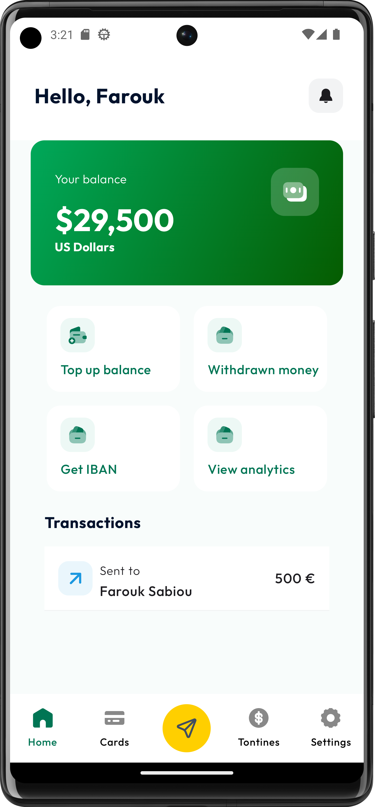
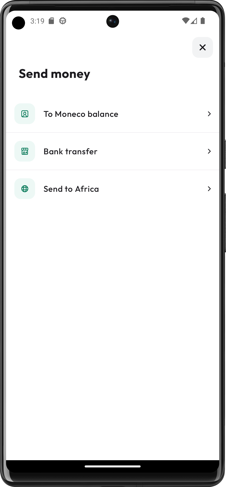
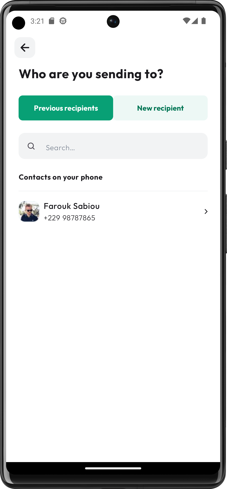
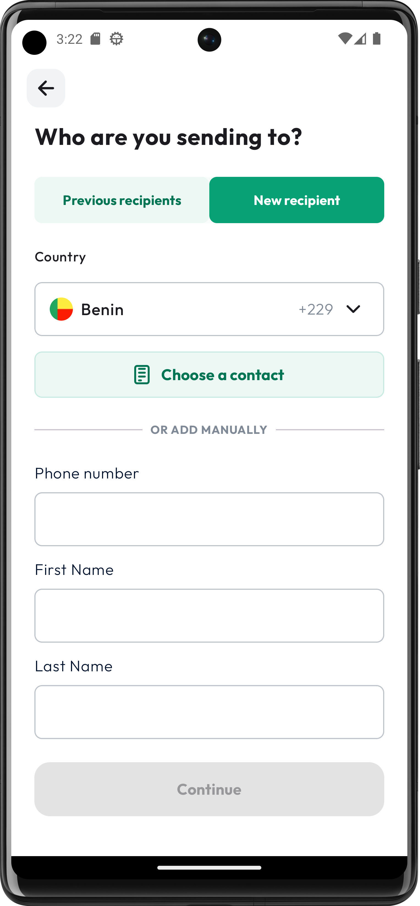
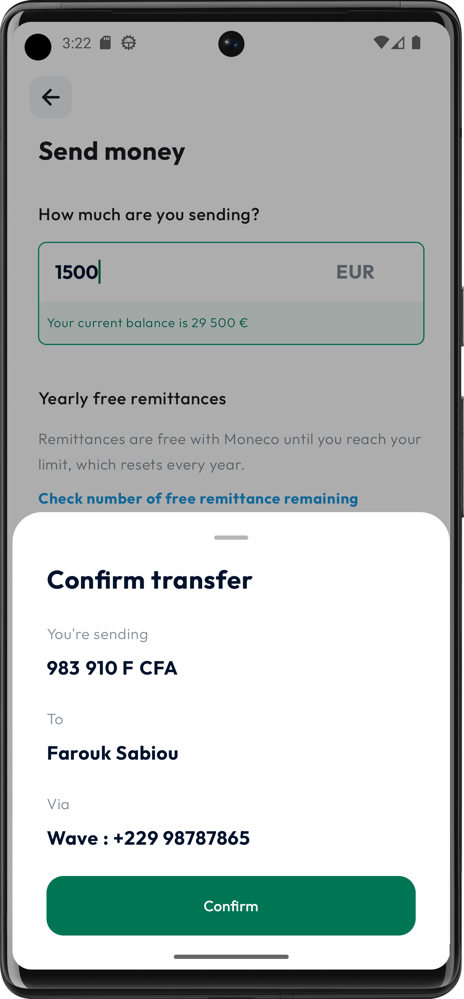

# Building and Running the App in Android Studio

This guide provides instructions on how to build and run the app in Android Studio.

## Prerequisites

Before building and running the app, ensure that you have the following:

- Android Studio (latest stable version recommended) installed on your machine.
- Android SDK with a minimum API level of 24 installed.

To build and run the RemitConnect app locally, follow these steps:

1. Install Android Studio, if not already installed, from the [official website](https://developer.android.com/studio).
2. Clone the project repository: `git clone https://github.com/sabiou/RemitConnect.git`.
3. Open Android Studio and select "Open an existing Android Studio project."
4. Navigate to the cloned repository and select the project's root directory.
5. Android Studio will sync and build the project automatically.
6. Connect an Android device or start an emulator.
7. Click on the "Run" button in Android Studio or use the keyboard shortcut Shift+F10 to build and run the app on the connected device/emulator.
8. The RemitConnect app will launch on the device/emulator, and you can explore its features and functionality.

## Screenshots

  
  
  
  
  

## Tech Stack

The RemitConnect app is built using the following technologies and libraries:

- Android Studio: The official integrated development environment (IDE) for Android app development.
- Kotlin: The programming language used for developing the Android app.
- Android SDK: The software development kit that provides the necessary tools and libraries for Android app development.
- Jetpack Compose: A modern UI toolkit for building native Android apps with a declarative approach.
- Dagger Hilt: A dependency injection library for Android that simplifies the setup and management of dependencies.
- Room: A persistence library that provides an abstraction layer over SQLite for database operations.
- Coroutine: Kotlin's native asynchronous programming framework for managing concurrency and simplifying asynchronous code.
- Navigation Component: A library for implementing navigation in Android apps, simplifying the navigation flow between different screens.
- JUnit: A widely used testing framework for Java and Kotlin applications.
- Android Testing Support Library: Libraries that provide support for testing Android apps, including AndroidJUnitRunner and test rules.
- Accompanist: A collection of libraries and utilities for building Jetpack Compose apps, including navigation support and material design integration.

Note: Make sure you have the required SDK versions and dependencies specified in the Gradle files to successfully build and run the app.

## Troubleshooting

If you encounter any issues while building or running the app, consider the following steps:

- Make sure you have a stable internet connection to download dependencies.
- Check that your Android SDK is properly installed and up to date.
- Verify that the selected device or emulator is running the required API level or higher.
- Clean and rebuild the project by going to "Build" > "Clean Project" and then "Build" > "Rebuild Project".
- If you encounter build errors related to dependencies, try syncing the project again by clicking the "Sync Project with Gradle Files" button in the toolbar.

## Additional Information

- For running tests, you can use the provided JUnit and Espresso dependencies. Refer to the official Android Testing documentation for more details on writing and executing tests.

- If you encounter any specific issues related to the app's functionality or setup, refer to the project's documentation or seek help from the project's maintainers.

- Remember to consult the official Android Studio documentation for more advanced topics or specific troubleshooting steps.

Enjoy using the app!